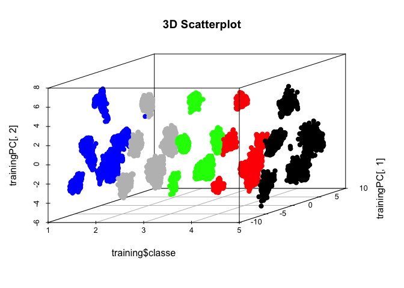

# ML
aaron gowins  
October 19, 2015  


# Writeup

### Exploration

We will be examining some exercise data to look for patterns. Our goal is to predict the type of workout, indicated by the "classe" variable, using the other metrics. The data is provided by [Groupware](http://groupware.les.inf.puc-rio.br/har), from the paper cited at the end of this document. We are suppressing messages and warnings, all pertain to release dates.


```r
URL<-"https://d396qusza40orc.cloudfront.net/predmachlearn/pml-training.csv"
download.file(URL,destfile="TRAIN",method="curl")
trainer<-read.csv(file="TRAIN",header=TRUE,sep=",")
URL2<-"https://d396qusza40orc.cloudfront.net/predmachlearn/pml-testing.csv"
download.file(URL2,destfile="TEST",method="curl")
tester<-read.csv(file="TEST",header=TRUE,sep=",")
dimRow<-dim(trainer)[1]
dimCol<-dim(trainer)[2]
```

We have a dataset with 19622 rows, and 160 columns.


```r
#library(googleVis)
library(ggplot2)
```

```
## Warning: package 'ggplot2' was built under R version 3.1.3
```

```r
library(MASS)
```

All the users are plotted together below and colored by user to see a comparison of the overall counts of the classe variable among users.


```r
ggplot(data=trainer,aes(x=classe,fill=user_name)) + geom_bar()
```

 

```r
trainer$classe<-as.numeric(trainer$classe)
trainer$classe<-as.factor(trainer$classe)
```

Next we will divide the training set into training and testing components, and produce a plot that primarily underscores the complexity of the dataset. 


```r
library(caret)
```

```
## Warning: package 'caret' was built under R version 3.1.3
```

```
## Loading required package: lattice
```

```r
inTrain<-createDataPartition(y=trainer$classe,p=.75,list=FALSE)
training<-trainer[inTrain,]
testing<-trainer[-inTrain,]
library(car)
```

```
## Warning: package 'car' was built under R version 3.1.3
```

```r
library(AppliedPredictiveModeling)
#featurePlot(x=trainer[,30:34],y=trainer$classe,plot="pairs",auto.key = list(columns = 3))
scatterplotMatrix(trainer[30:34])
```

 

### Cleaning

We will set NA's to zero, which for continuous variables is unacceptible practice. If this was a real analysis, we should be imputing these NA's using the "mice" package, but that is a whole topic of it's own.

Note that we are applying any data transformation to both the training set and the testing set we arbitrarily created. If we fail to do this we will most likely get an error message, but if an error is not thrown then we will botch our analysis in epically embarrassing fashion.


```r
set.seed(111)

trainer[is.na(trainer)]<-0
training[is.na(training)]<-0
testing[is.na(testing)]<-0
tester[is.na(tester)]<-0
```

Near zero variance varibles can add tremendous computational time, not to mention other problems, while providing essentially no information. This is not always true, and it's poor form to remove them without showing that it makes sense to do so. We will skip over the explanation and assume that good model performance is evidence enough that removing NZV's is okay here (which I believe is broadly true).


```r
x<-nearZeroVar(training)
trainer<-trainer[,-x]
training<-training[,-x]
testing<-testing[,-x]
tester<-tester[,-x]
```
  
### Dimension Reduction
  
Now let's find out if it makes sense to reduce the dimensionality of the dataset. One approach 
would be to look for highly correlated variables. I set the threshold at 0.9 so that we get a manageable list of correlated variables, 0.9 is a very high correlation.


```r
M<-abs(cor(training[,c(-2,-5,-6,-59)]))
diag(M)<-0
     which(M>.9,arr.ind=T)
```

```
##                  row col
## total_accel_belt   7   4
## accel_belt_y      12   4
## accel_belt_z      13   4
## accel_belt_x      11   5
## roll_belt          4   7
## accel_belt_y      12   7
## accel_belt_z      13   7
## pitch_belt         5  11
## roll_belt          4  12
## total_accel_belt   7  12
## accel_belt_z      13  12
## roll_belt          4  13
## total_accel_belt   7  13
## accel_belt_y      12  13
## gyros_arm_y       22  21
## gyros_arm_x       21  22
## gyros_dumbbell_z  36  34
## gyros_forearm_z   49  34
## gyros_dumbbell_x  34  36
## gyros_forearm_z   49  36
## gyros_dumbbell_x  34  49
## gyros_dumbbell_z  36  49
```

All these highly correlated variables makes dimension reduction a no brainer. We'll apply a PCR model to address this, and find out how many components we need by running and analyzing a model on the training data.


```r
prepro<-preProcess(training[,c(-2,-5,-6,-59)],method="pca",pcaComp=11)
trainingPC<-predict(prepro,training[,c(-2,-5,-6,-59)])
colors <- c("blue", "grey", "green","red","black")
```
 

It would be nice to see how the first two principal components are doing in terms of separating the data, below we see five distinct regions developing.


```r
qplot(trainingPC[,1],trainingPC[,2],data=training,colour=classe)
```

 

This plot shows some grouping, but we are ignoring our dependent variable on this plot. A 3-d plot can add the classe variable to this visualization, and we can see that the first two principal components do a visually reasonable job of identifying classes 2 and 3.


```r
library(scatterplot3d)
```

```
## Warning: package 'scatterplot3d' was built under R version 3.1.3
```

```r
library(ggplot2)
colors <- colors[as.numeric(training$classe)]
scatterplot3d(x=training$classe,y=trainingPC[,1],z=trainingPC[,2], main="3D Scatterplot",
              pch=19,color=colors)
```

 

### Model Training

I'm thinking that no one doubts at this point that PCA is a good idea, we see the data being segmented by classe already with just the first two principal components. We also see that there is not nearly enough segmentation in the first two PC's to expect a good prediction.

I suggest a linear discriminant model simply because I like the idea of following PCA with LDA, since they are related ideas. PCA looks for the axis orientation that maximizes the variance, while LDA maximizes the component axes for the best class separation. Combining these approaches is intuitive and efficient. For a brilliant tutorial on combining these approaches see [Sebastian Raschka's blog](http://sebastianraschka.com/Articles/2014_python_lda.html). He is coding in Python, but we should probably be working toward bringing our Python skills up to speed with our R skills by now. 

#### Quick Python Plug
Python can be more intuitive and less opaque than R, and has some distinct advantages over R when it comes to speed and scaling. In my opinion most Natural Language Processing is better and easier in Python. Python also has terrific plotting packages that in my mind blow R away for simplistic coding and pure aesthetics. Visit [matplotlib.org](http://matplotlib.org/#) and click on any plot for a code template to see what I mean, the documentation is truly impressive. I still prefer R and its vast statistical libraries for most common applications, but I often find myself getting less frustrated using Python to do something new. If a task seems intimidating or coding-intensive, or if I know what I want to do but there's not really a name for it, I lean toward Python now. 

#### Returning to the Model
If we were to use every variable in our LDA, we would be able to predict our arbitrarily created training and test sets perfectly. However, that's boring, so let's pretend like for some reason we can't do that or don't want to. Here I am employing k-fold cross validation with 3 iterations, although for subtle reasons in our case this won't make any difference for our accuracy. It's here just for future reference (for show).


```r
library(caret)
```

```
## Warning: package 'caret' was built under R version 3.1.3
```

```
## Loading required package: lattice
```

```r
modelFit<-train(training$classe ~ .,method="lda",data=trainingPC,trControl=trainControl(method="cv",number=5,repeats=3))
train.lda<-predict(modelFit,trainingPC)
confusionMatrix(training$classe,predict(modelFit,trainingPC))
```

```
## Confusion Matrix and Statistics
## 
##           Reference
## Prediction    1    2    3    4    5
##          1 2913  476  380  192  224
##          2  639 1255  366  225  363
##          3  631  302 1048  148  438
##          4  111  293  255 1003  750
##          5  112  479  546  388 1181
## 
## Overall Statistics
##                                           
##                Accuracy : 0.5028          
##                  95% CI : (0.4947, 0.5109)
##     No Information Rate : 0.2994          
##     P-Value [Acc > NIR] : < 2.2e-16       
##                                           
##                   Kappa : 0.3695          
##  Mcnemar's Test P-Value : < 2.2e-16       
## 
## Statistics by Class:
## 
##                      Class: 1 Class: 2 Class: 3 Class: 4 Class: 5
## Sensitivity            0.6611  0.44742  0.40385  0.51278  0.39953
## Specificity            0.8766  0.86628  0.87470  0.88959  0.87035
## Pos Pred Value         0.6961  0.44066  0.40826  0.41584  0.43644
## Neg Pred Value         0.8583  0.86942  0.87269  0.92256  0.85223
## Prevalence             0.2994  0.19058  0.17631  0.13290  0.20084
## Detection Rate         0.1979  0.08527  0.07121  0.06815  0.08024
## Detection Prevalence   0.2843  0.19350  0.17441  0.16388  0.18386
## Balanced Accuracy      0.7689  0.65685  0.63928  0.70119  0.63494
```

Our model is a little heavy on specificity, so we are getting fewer false positives and more false negatives, although balanced accuracy is really the best measure of accuracy unless you have a legitimate reason to prefer either specificity or sensitivity. In that case, it's essential to understand at some level how the two are related.

### Model Testing

Next we apply our model to the arbitrary test set we created in the beginning. Remember that the testing set was modified the same way as the training set from the beginning. (I always feel like I'm at a magic show when I watch tutorials. Sorry if that ruins tutorials for you, but I think it's funny. Drum roll, please...)


```r
testingPC<-predict(prepro,testing[,c(-2,-5,-6,-59)])
testy<-predict(modelFit,testingPC)
confusionMatrix(testing$classe,predict(modelFit,testingPC))
```

```
## Confusion Matrix and Statistics
## 
##           Reference
## Prediction   1   2   3   4   5
##          1 984 158 115  59  79
##          2 209 419 117  75 129
##          3 230  71 365  51 138
##          4  36 107  91 358 212
##          5  37 170 188 149 357
## 
## Overall Statistics
##                                           
##                Accuracy : 0.5063          
##                  95% CI : (0.4922, 0.5204)
##     No Information Rate : 0.3051          
##     P-Value [Acc > NIR] : < 2.2e-16       
##                                           
##                   Kappa : 0.3736          
##  Mcnemar's Test P-Value : < 2.2e-16       
## 
## Statistics by Class:
## 
##                      Class: 1 Class: 2 Class: 3 Class: 4 Class: 5
## Sensitivity            0.6578  0.45297  0.41667   0.5173   0.3902
## Specificity            0.8794  0.86680  0.87835   0.8941   0.8636
## Pos Pred Value         0.7054  0.44152  0.42690   0.4453   0.3962
## Neg Pred Value         0.8541  0.87206  0.87380   0.9185   0.8606
## Prevalence             0.3051  0.18862  0.17863   0.1411   0.1866
## Detection Rate         0.2007  0.08544  0.07443   0.0730   0.0728
## Detection Prevalence   0.2845  0.19352  0.17435   0.1639   0.1837
## Balanced Accuracy      0.7686  0.65989  0.64751   0.7057   0.6269
```

### TA-DA!!

We got slightly better results on the arbitrary testing set, which is a good indication that we are not overfitting. We could have guessed that overfitting would not be a problem based on the number of dimensions we cut out.

### Predictions

Now let's see what our predictions are for that mystery data. We will turn the answers back into letters for easier comparison.


```r
testerPred<-predict(prepro,tester[,c(-2,-5,-6,-59)])
testerPre<-predict(modelFit,testerPred)
levels(testerPre)<-c("A","B","C","D","E")
plot(testing$classe,testy)
```

 

```r
testerPre
```

```
##  [1] C A A A A C D D A A A A B A E A A B B B
## Levels: A B C D E
```

So there we have it. I optimized the number of principal components according to the least number of "A"'s. There are 14 correct out of 20, which is higher than the predicted accuracy, why is that?


Velloso, E.; Bulling, A.; Gellersen, H.; Ugulino, W.; Fuks, H. Qualitative Activity Recognition of Weight Lifting Exercises. Proceedings of 4th International Conference in Cooperation with SIGCHI (Augmented Human '13) . Stuttgart, Germany: ACM SIGCHI, 2013.

Read more: http://groupware.les.inf.puc-rio.br/har#ixzz3p8XTtotD


.
